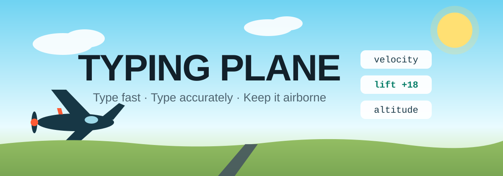

<p align="center">
  
</p>

<h1 align="center">Typing Plane</h1>

<p align="center">
  <em>A typing game where every correct word is lift.<br/>Type fast, type accurately — or watch your plane fall out of the sky.</em>
</p>

<p align="center">
  <a href="https://mufaddalkt.github.io/typing-game/"></a>
</p>

<p align="center">
  
  
  
</p>

---

## ✈️ How it works

Your plane is constantly losing altitude. Every word you type correctly converts into **lift** — longer words and hot streaks earn bigger boosts. Wrong keystrokes rattle the airframe and bleed lift away. Hit zero lift and it's a crash dive.

## ✨ Features

- **Adaptive difficulty** — word length adapts to your rolling WPM, with Calm / Cruise / Storm presets and a Tailwind–Headwind indicator
- **Live flight HUD** — WPM, accuracy, distance, streak, and a lift gauge with low-altitude **PULL UP!** warnings
- **Trouble-word drills** — the game tracks your misses and offers a focused drill round on exactly those words
- **Game feel** — WebAudio sound effects (mutable), streak glow, screen shake, 3-2-1 countdown, animated crash dive
- **Flight log & report cards** — per-word timings plus an end-of-flight summary
- **Zero dependencies** — one self-contained `index.html`; light & dark mode; mobile-friendly; auto-pauses when the tab loses focus

## 🕹️ Controls

| Input | Action |
|-------|--------|
| Type the shown word | Gain lift |
| `Space` | Start / restart flight |
| `Esc` | Pause / resume |
| 🔊 button | Mute / unmute |

## 🎚️ Difficulty presets

| Preset | Lift drain | Word boost | Best for |
|--------|-----------|------------|----------|
| **Calm** | Gentle | Generous | Warming up |
| **Cruise** | Moderate | Balanced | Everyday practice |
| **Storm** | Fierce | Lean | Chasing speed records |

Within a flight, word length adapts to your rolling WPM so you're always in the flow zone.

## 📊 Scoring

- **WPM** — standard (characters ÷ 5) per minute, clocked from your first keystroke; the clock pauses when you pause
- **Accuracy** — correct keystrokes ÷ total keystrokes
- **Distance** — grows with time aloft and words completed
- **Streak** — consecutive perfect words; streaks add bonus lift

## 🚀 Play it

**Live demo** → [mufaddalkt.github.io/typing-game](https://mufaddalkt.github.io/typing-game/)

> The included GitHub Actions workflow deploys automatically on every push to `main` — just enable **Pages** in the repo settings (Settings → Pages → Source: *GitHub Actions*).

**Run locally** → download `index.html` and open it in any modern browser. No build step, no server.

## 🗂️ Project structure

```
typing-game/
├── index.html                  # the entire game — markup, styles & logic
├── assets/
│   └── banner.svg              # README hero art
├── .github/
│   └── workflows/
│       └── deploy-pages.yml    # auto-deploy to GitHub Pages
├── CONTRIBUTING.md
└── LICENSE
```

## 🤝 Contributing

Ideas and PRs are welcome! The whole game lives in a single `index.html` — see [CONTRIBUTING.md](CONTRIBUTING.md) for the quick guide.

## 📄 License

MIT — see [LICENSE](LICENSE).
